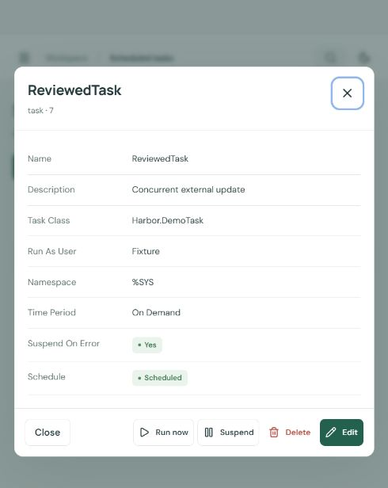

# Expanded correctness and security review

September 26, 2026. This review follows the user's request to keep investigating after fixes, instead of stopping after the first finding. It covers the three related portals, with the project-specific changes identified below. It is not proof that all possible defects are absent.

## Corrections

| Area                     | Defect and resulting behavior                                                                                                                                                                                                                                                                                                                                                                                                                                 |
| ------------------------ | ------------------------------------------------------------------------------------------------------------------------------------------------------------------------------------------------------------------------------------------------------------------------------------------------------------------------------------------------------------------------------------------------------------------------------------------------------------- |
| Shared task editor       | Editing sent the full loaded task despite reviewing only changed fields. A concurrent change to an untouched setting could be overwritten. Edits now send the changed fields; task creation still sends the complete defaults required by IRIS. Existing same-field conflict checks remain.                                                                                                                                                                   |
| Atlas captures           | Missing/wrongly typed detail fields could become false/empty values in an apparently complete capture; malformed list entries could crash capture and detail Name could replace the requested identity. Selected access metadata is now schema-validated. Invalid or duplicate rows produce warnings; failed details remain explicitly unavailable. Canonical requested identities are preserved, unrelated fields are excluded, and warning text is bounded. |
| Atlas unknown evidence   | Empty unavailable markers were interpreted inconsistently. Presence of the marker now excludes authoritative role traversal and review findings. Account status is displayed as unknown when details are unavailable.                                                                                                                                                                                                                                         |
| Atlas role paths         | A shorter path through an escalation-only role could hide a longer ordinary path. Traversal now prefers an unconditional path and propagates that correction through descendants. The result remains configuration evidence, not runtime authorization.                                                                                                                                                                                                       |
| Shared REST explorer     | Switching endpoint or parameters during an in-flight request could associate the old response with a new query. Relevant controls are disabled while waiting, and changing parameters clears the previous result.                                                                                                                                                                                                                                             |
| Relay refresh            | Refresh could overlap selection, creation or step actions and later replace their displayed state. These actions now remain disabled until the refresh completes.                                                                                                                                                                                                                                                                                             |
| Shared log following     | Automatic refresh could start another read before the previous read completed. One read at a time prevents older poll results overwriting newer results within the same source.                                                                                                                                                                                                                                                                               |
| Shared sign-out          | Failed logout promises had no user-visible error. The app now shows an explicit failure and retry control, and clears that message after a subsequent login. It does not claim that an unconfirmed logout succeeded.                                                                                                                                                                                                                                          |
| Shared upstream protocol | Primitive/null documents produced internal errors or invalid success data. HTTP 202 without a usable job ID could appear complete. Both now produce controlled 502 errors; accepted operations with missing IDs explicitly warn that native state must be checked before retrying.                                                                                                                                                                            |

## Evidence

- All 95 tests in this project pass; the total is **264** across Harbor (75), Access Atlas (94), and Relay (95). TypeScript and production bundles pass.
- New deterministic fixtures reproduced malformed captures, identity substitution, the conditional-path error, invalid documents and missing asynchronous IDs before fixes. Existing security regressions still pass.
- A generated graph test compares 80 cyclic graphs against an independent reachability calculation, including ordinary and conditional paths.
- A real disposable IRIS task accepted a partial edit and preserved its other settings; it was then removed. Each project's permanent live workflow now verifies that a partial edit preserves a concurrent change to another task field.
- The built Harbor UI, backed by an isolated local fixture, sent only the reviewed Name field. The fixture's concurrent Description update survived. The shared editor source is identical in all three projects.
- Delayed fixture responses confirmed disabled REST endpoint selection and Relay action/create controls, followed by successful re-enabling. A visible log-following page retained one pending read across refresh intervals. A failed logout displayed an error and retry control without an unhandled browser exception.
- Rebuilt local instances passed installed-gateway, native smoke and extended workflows. Atlas live access analysis and Relay runbooks passed.
- X.509 import/update/read/cleanup and suspension/resumption/termination of explicitly created demo workers passed on all three instances. Generated certificate files and worker processes were cleaned up.
- npm audit reported zero known vulnerabilities in the dependency trees. All six Compose containers were healthy.
- Source parity checks confirm identical shared editor/explorer/log/redaction/limit code and gateways differing only by the project namespace.

The screenshot shows the isolated Harbor fixture after changing the task name while preserving a concurrent description update; it is not production business data.

Detailed logs and the browser fixture are retained in the parent workspace under research/deep-review-* and research/browser-fixture.cjs. The fixture servers were stopped after testing.

## Final review and remaining limits

After the corrections, another source/diff review and the final automated, browser and native integration checks found no further actionable defects in the tested paths. Final login/static/API checks were repeated after rebuilding the last UI change. This is the stopping criterion for this request, not a mathematical guarantee or a new permanent repeating audit.

The review revisited sessions, origins/CSRF, fixed upstream targets, credential masking, request/response budgets, Relay owner/instance isolation and persistence, Atlas imports/captures/graphs, editors, asynchronous results, polling, and presentation of native data. It does not certify IRIS or container OS packages, test IRIS for Health or a full external OAuth provider flow, or remove the documented read-before-write race with external native changes. Relay locks coordinate one process. Arbitrary secrets in logs cannot be inferred perfectly. No external target, publication or destructive load test was used; the previously rejected trickling-stream probe was not retried.
