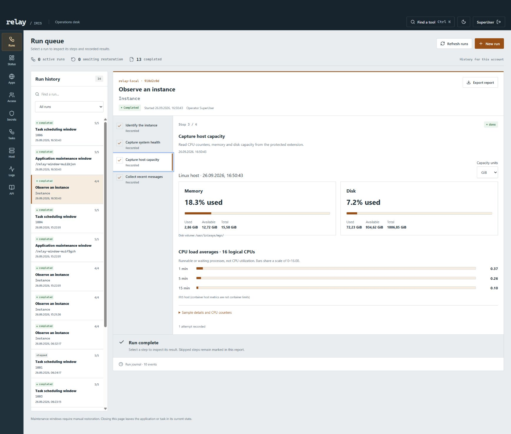

# Your first observation and handover

Start with a saved observation. It reads IRIS without changing an application or task schedule. Follow the [installation steps](../README.md#quick-start-complete-local-installation), sign in with an account allowed to read the selected sources, and open **Runs** in the navigation (labelled **Runbooks** in the tool finder). The page heading is **Run queue**.

The **Operations desk** summarizes saved work and follow-ups; use **Run queue** to create the first run.

## Capture an observation

1. Select **New run → Observe an instance**. Keep the four default sources: instance identity, system health, host capacity and recent messages. Give the run a name you will recognize in history.
2. Read the plan and select **Create run**. This saves the plan; it has not collected the observations yet.
3. Select **Run next step**. Inspect the recorded result and timestamp, then repeat for the remaining steps. Selecting an earlier step shows its saved evidence; it does not run that step again.
4. Read any unavailable-source or size-limit notice. A recorded response is evidence of what IRIS returned, not a certificate that the instance is healthy. If a read fails, inspect its error before explicitly retrying.
5. Add an **Observation**, **Decision** or **Follow-up** under **Operator notes**, then select **Append note**. For example, record which source needs further investigation and why.
6. Select **Export report** to retain the run as JSON. Reopen it from run history to confirm that the saved results and note are still present.

If creation reports an uncertain result, the plan may already be saved. Choose **Check saved runs** and inspect the refreshed history before creating another plan. This reads the list without repeating creation or executing a step. If the list cannot be read, the dialog keeps your fields and lets you retry the read. Close and reopen the creation dialog only after checking for the original plan; closing discards its in-memory fields.

## Hand over the result

Select **Prepare handover** in the run. Enter an intended recipient, a short summary and any outstanding risks. Use **Add follow-up** for a concrete next action; its optional deadline is labelled **Due (UTC)**. Select **Save handover details**, then download **Printable report** or **JSON package**.

If you close an edited handover, choose **Keep editing** to retain the draft or **Discard draft** to remove your unsaved changes. Escape from that confirmation returns to the editor. A refused save leaves your text available to review. Switching tools suspends an open run dialog; returning to **Runs** restores its draft. Drafts remain in memory only: save before reloading the browser or signing out.

Send that file through your normal team channel. Mark delivery only after you have done so: Waypoint records your statement but does not send a message or confirm receipt. The package includes recorded evidence and unresolved work; it does not give another account permission to execute this run. Run history remains scoped to its owner and configured instance.

## Optional: try a maintenance window

Use a disposable application route or task on an instance where you are authorized to change it. The [one-minute recording](https://www.youtube.com/watch?v=ZKfUzavGfEo) demonstrates an application window using a temporary route.

1. Create an **Application maintenance window** or **Task scheduling window** and type the exact target identifier. Inspect the plan before saving it.
2. Execute the first step, **Record the original state** for an application or **Record task scheduling state** for a task. Read the saved value before continuing: restoration returns to this value, so an originally disabled application or suspended task remains that way.
3. Execute the next transition and inspect its read-back. Application maintenance disables the route; task maintenance suspends future scheduling. Neither action promises to terminate existing work or sessions.
4. Do the intended maintenance outside Waypoint, enter the checkpoint note, then continue to restore the original state. **Restore now** allows early restoration if you need to skip the checkpoint. Finish the closing evidence step.
5. If the result is uncertain, use **Check current state** before another decision. If the browser says the action result has not been retrieved, use **Refresh runs** first to retrieve the current saved record.

Closing the browser does not restore the target. Keep the run open until its restoration is verified; if access is lost, an authorized administrator must restore it through an available management interface. A handover report does not release that obligation or undo maintenance performed outside Waypoint.

See [runbook behavior and recovery](RUNBOOKS.md) for exact transitions, persistence and limits. The [run detail](../src/features/runbooks/RunDetail.tsx) and [handover controls](../src/features/runbooks/RunRecordTools.tsx) implement the actions above.
